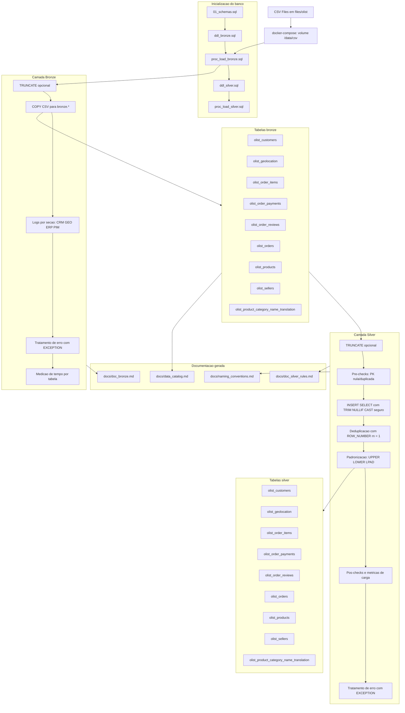

# Data Flow Diagram

```mermaid
flowchart TD
    A[CSV Files em files/olist] --> B[docker-compose: volume /data/csv]

    subgraph INIT[Inicializacao do banco]
        C[01_schemas.sql]
        D[ddl_bronze.sql]
        E[proc_load_bronze.sql]
        F[ddl_silver.sql]
        G[proc_load_silver.sql]
        C --> D --> E --> F --> G
    end

    B --> E

    subgraph BRONZE[Camada Bronze]
        E1[TRUNCATE opcional]
        E2[COPY CSV para bronze.*]
        E3[Logs por secao: CRM GEO ERP PIM]
        E4[Tratamento de erro com EXCEPTION]
        E5[Medicao de tempo por tabela]
        E1 --> E2 --> E3 --> E4 --> E5
    end

    E --> E1

    subgraph BRONZE_TABLES[Tabelas bronze]
        BT1[olist_customers]
        BT2[olist_geolocation]
        BT3[olist_order_items]
        BT4[olist_order_payments]
        BT5[olist_order_reviews]
        BT6[olist_orders]
        BT7[olist_products]
        BT8[olist_sellers]
        BT9[olist_product_category_name_translation]
    end

    E2 --> BRONZE_TABLES

    subgraph SILVER[Camada Silver]
        G1[TRUNCATE opcional]
        G2[Pre-checks: PK nula/duplicada]
        G3[INSERT SELECT com TRIM NULLIF CAST seguro]
        G4[Deduplicacao com ROW_NUMBER rn = 1]
        G5[Padronizacao: UPPER LOWER LPAD]
        G6[Pos-checks e metricas de carga]
        G7[Tratamento de erro com EXCEPTION]
        G1 --> G2 --> G3 --> G4 --> G5 --> G6 --> G7
    end

    BRONZE_TABLES --> G1

    subgraph SILVER_TABLES[Tabelas silver]
        ST1[olist_customers]
        ST2[olist_geolocation]
        ST3[olist_order_items]
        ST4[olist_order_payments]
        ST5[olist_order_reviews]
        ST6[olist_orders]
        ST7[olist_products]
        ST8[olist_sellers]
        ST9[olist_product_category_name_translation]
    end

    G5 --> SILVER_TABLES

    subgraph DOCS[Documentacao gerada]
        H1[docs/data_catalog.md]
        H2[docs/doc_bronze.md]
        H3[docs/naming_conventions.md]
        H4[docs/doc_silver_rules.md]
    end

    BRONZE --> H2
    SILVER --> H4
    BRONZE_TABLES --> H1
    SILVER --> H3
```
